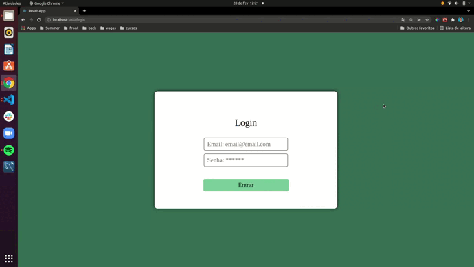
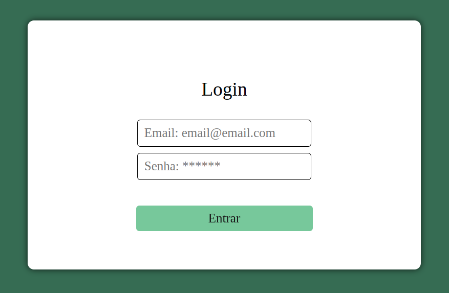
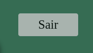

# Crypto-index

## Descrição do Projeto

<p>Uma aplicação web que exibe a cotação de moedas em Bitcoins em relação ao dólar. O front-end foi desenvolvido em React v17 utilizando JavaScript ES6. A estilização foi feita utilizando styled components, com componentes reutilizáveis sempre que necessário. Para o back-end foi construída uma API em NodeJs, em uma arquitura MSC com pequenas adaptações. A camada "model" não foi utilizada, uma vez que a comunicação com banco de dados não era necessária. Como próximos passos, a implementação de testes unitários e de integração no back e o aumento de cobertura dos mesmos no front.</p> <p align="center">🚀 #VQV</p>


# Sumário
<p align="center"> <a href="#tecnologias">Tecnologias</a> • <a href="#tecnologias">Como rodar a aplicação</a> • <a href="#componentes">Componentes</a> • <a href="#desenvolvedor">Desenvolvedor</a></p>
<br/>

## Demonstração da aplicação
<br/>

<br/>
<br/>

## Tecnologias

- <a href="https://pt-br.reactjs.org/docs/getting-started.html" target="_blank" >React</a>
- <a href="https://styled-components.com/" target="_blank" >Styled Components</a>
- <a href="https://nodejs.org/en/" target="_blank" >NodeJs</a>
- <a href="https://testing-library.com/docs/react-testing-library/intro/" target="_blank">React esting Library</a>
- <a href="https://react-select.com/home" target="_blank" >React - Select</a>
- <a href="https://www.npmjs.com/package/react-toastify" target="_blank" >Toastify</a>
- <a href="https://www.npmjs.com/package/joi" target="_blank" >Joi</a>
- <a href="https://www.npmjs.com/package/yup" target="_blank" >Yup</a>

<br/>

##  Pré-requisitos e como rodar a aplicação

Antes de começar, você vai precisar ter instalado em sua máquina as seguintes ferramentas:  
[Git](https://git-scm.com/), [Node.js](https://nodejs.org/en/).  

Clone o repositório, acesse a pasta que você acabou de clonar. Em seguida entre na pasta do front e instale as dependências do projeto, utilizando o seguinte comando no terminal:
> ``` npm install ```

Mude para a pasta do back ou abra um novo terminal e acesse a pasta do back. Dentro da pasta do back instale as dependências:
> ``` npm install ```

Abra dois terminais, um será responsável por rodar a aplicação no front e a outra no back. Para a aplicação front rode o seguinte comando no terminal:
> ``` npm start ```

Para rodar a aplicação back temos duas opções:

1- Rodar a aplicação utilizando o `nodemon`:
> ``` npm run dev ```

A vatagem de se utilizar o `nodemon` é que as alterações realizadas fazem com que a aplicação seja restartada, não sendo necessário derrubar o servidor e abrir novamente.

2- Rodar a aplicação diretamente utilizando comando `node`:
> ``` npm start ```

Testes unitários foram implementados para uma pequena parte da aplicação front. Caso queira rodar os testes ja implementados basta rodar o seguinte comando dentro da aplicação front:

>```npm test tests/login.test.js```

## Componentes

### GlobalButton

Descrição:

Botão de uso global na aplicação. Pode receber as `props`: `back`, `disabled`, `login`, `children`. A `props` `children` é responsável por exibir o texto do botão enquanto as outras são responsáveis pelo estilo aplicado ao botão.

Exemplos de uso:

Botão login:

```js
    <GlobalButton
      login
      children="Entrar"
      onClick={handlelogin}
    />
```

<br/><br/>

Botão voltar/sair:

```js
    <GlobalButton
      back
      children="Sair"
      onClick={handleLogout}
    />
```

<br/><br/>

## Desenvolvedor

<a href="https://github.com/alexandremhm">**Matheus Alexandre**</a>, tem 31 anos, é pessoa desenvolvedora fullstack, de Belo Horizonte, Minas Gerais. É bacharel em Química Tecnológica pelo CEFET-MG. Além disso, estudou Desenvolvimento Web na Trybe. 

